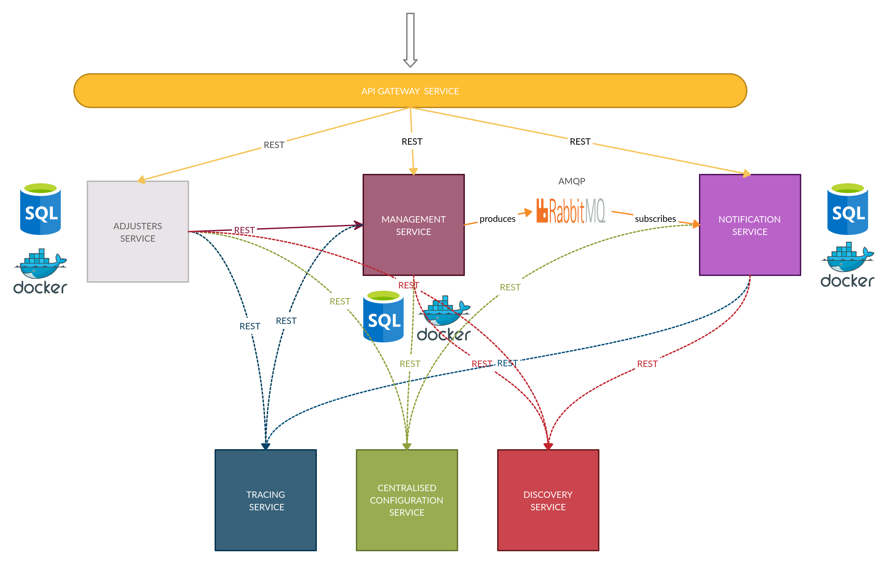

Project presents micorservices integration with spring cloud.
Contains microservices:

1. Api gateway.
Acts like input for foreign clients. Invokes api from other microservices.

2. Adjuster service.
Service for managing adjusters.

3. Loss management service.
Service for managing losses.

4. Notification service.
Service for notification handling. Subscribes for loss closed event. 

5. Tracing service.
Service for tracing other services.

6. Centrailised configuration service.
Allow other services to keep centralised configuration, which is fetched on startup.

7. Discovery service.
Keeps information about location of servies and provides health checks.

You can run application using run-services.sh script and stop by stop-services.sh script.

